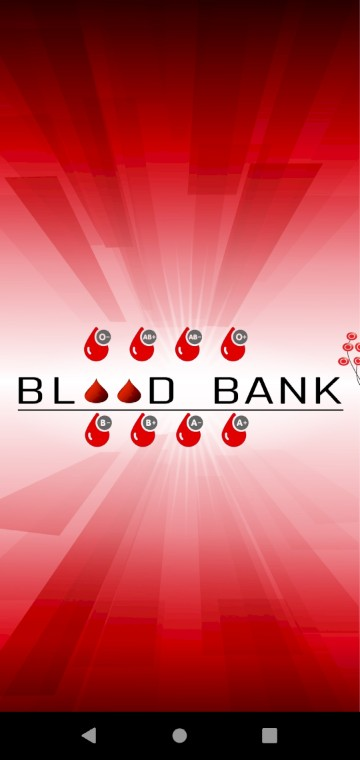
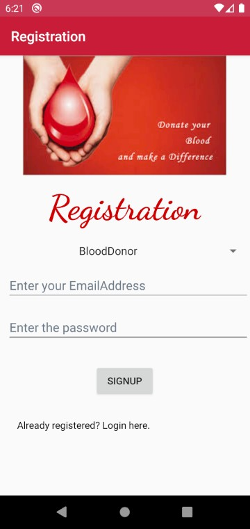
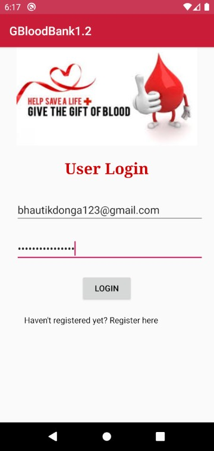
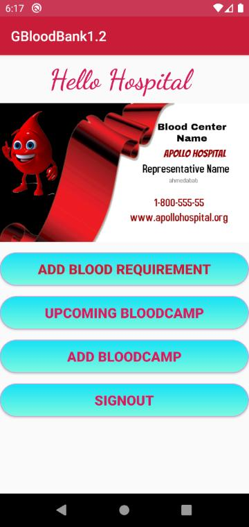
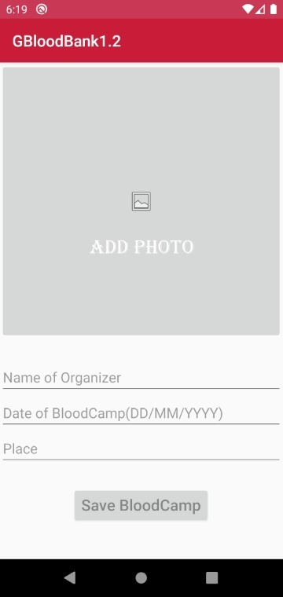
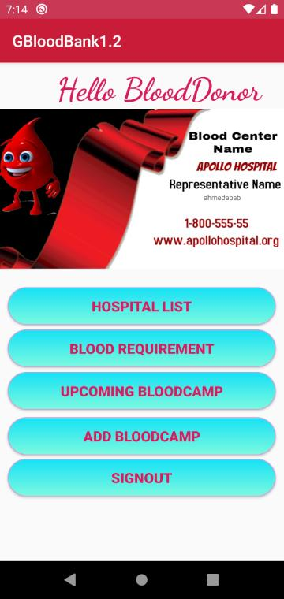
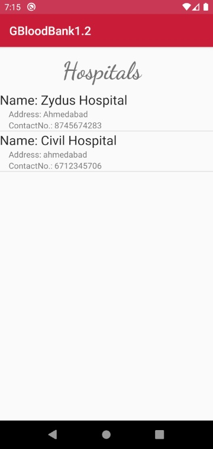
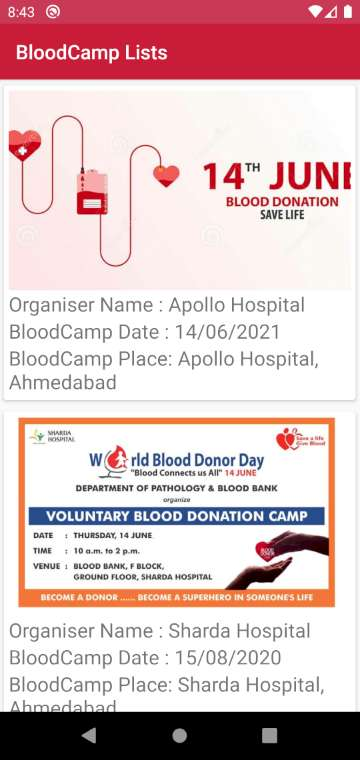

# Project: Blood Bank

***Blood Bank is an simple android app providing the platform between patients who need the blood and users who want to give blood heartly.***
 

There are some situations in which a man could go into the critical condition without the blood, however there are too many people in the world who wish to donate blood but 
don't get the proper news about the places at which blood camp is held or places where blood is needed.  

Therefore here we are trying to bring all (hospitals, people who like to donate blood, and people who need blood) on the common platform.

## Tools/Technology used:
* Android Studio
* Firebase Authentication
* Firebase Cloud Storage

## Screenshots of Features:

<table>
  <tr>
    <td>Splash Screen</td>
    <td>SignUp Screen</td>
    <td>LogIn Screen</td>
  </tr>
  <tr>
    <td></td>
    <td></td>
    <td></td>
  </tr>
  <tr>
    <td>HomePage for Hospitals</td>
    <td>Add BloodCamp Screen</td>
    <td>BloodRequirement List</td>
  </tr>
  <tr>
    <td></td>
    <td></td>
    <td></td>
  </tr>
    <tr>
    <td>HomePage for BloodDonor</td>
    <td>Hospital List</td>
    <td>BloodCamp Lists</td>
  </tr>
  <tr>
    <td></td>
    <td></td>
    <td></td>
  </tr>
 </table>

## Creators:
- Bhautik Donga (bhautikdonga123@gmail.com)
- Maulik Gelot (gelotmaulik002@gmail.com)
